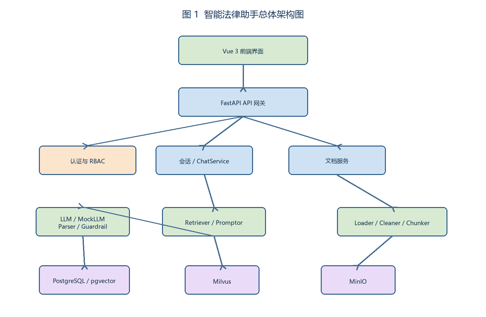
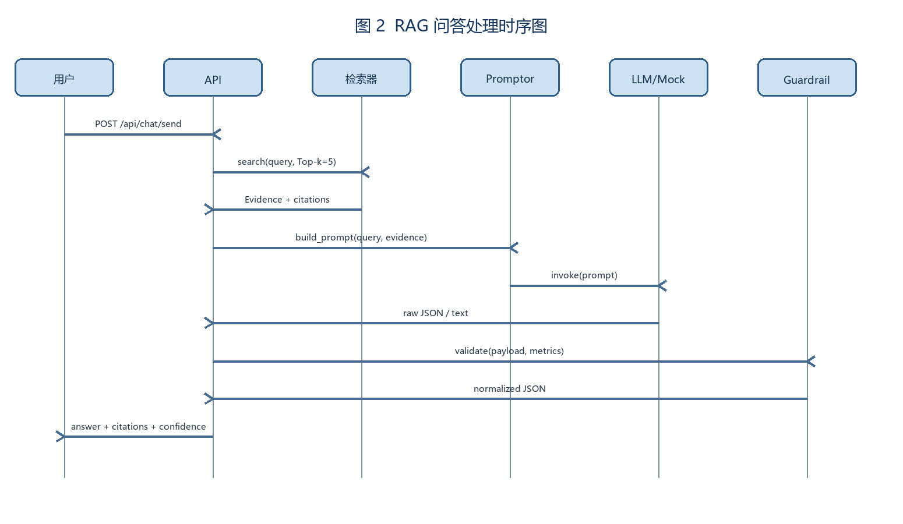
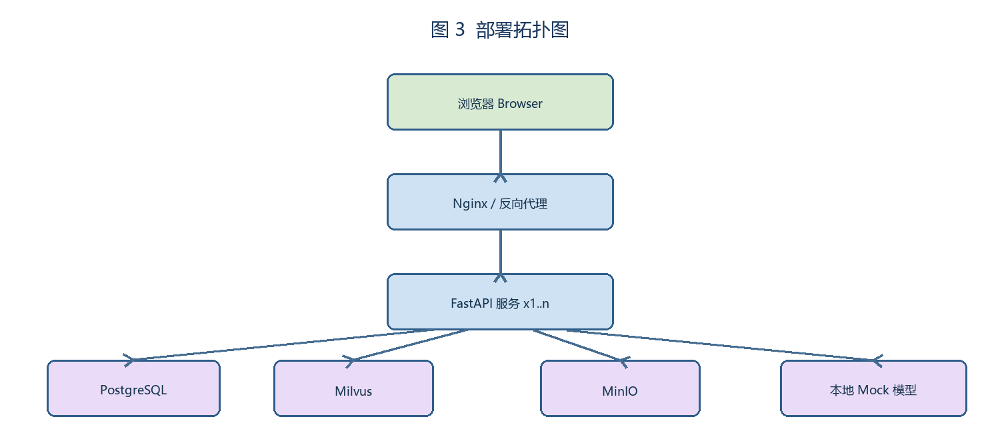

# 智能法律助手概要设计说明书（HLD）

| 项目 | 内容 |
|---|---|
| 版本 | v1.0 / 2026-07-16 |
| 依据 | SRS v1.0，代码路径 `backend/app`、`frontend/src` |
| 约束 | CPU/离线、JWT/RBAC、模型可 Mock |

## 1 架构概览



模块边界：API 只负责鉴权、参数和响应；业务服务编排；文档处理保持纯函数；向量层封装 Milvus 并提供 Mock；Guardrail 是最终一致性闸门；Logger 统一写 `logs/`。

## 2 模块设计与接口

| 模块 | 关键接口 | 输入/输出 | 配置 | 异常与降级 |
|---|---|---|---|---|
| Loader | `load(path)->list[Document]` | 文件→页文档 | `MAX_FILE_SIZE` | 不支持类型/损坏文件→422 |
| Cleaner | `clean(doc)->Document` | 原文→标准文本 | `CLEAN_RULES` | 编码异常→保留原文并告警 |
| Chunker | `split(text,500,50)->Chunk[]` | 文本→块 | `CHUNK_SIZE`,`OVERLAP` | 超长→分段；空文本→空集 |
| Indexer | `build/load()->Index` | 块→索引 | `MILVUS_URI`,`INDEX_PATH` | 服务不可用→Mock/重建 |
| Retriever | `search(q,k=5,bm25=False)` | 查询→证据 | `TOP_K`,`USE_BM25` | 空结果→友好提示 |
| Promptor | `build(query,docs)->str` | 查询+证据→Prompt | `MAX_CONTEXT_CHARS` | 超长→按分数裁剪 |
| LLM | `invoke(prompt)->str` | Prompt→原始结果 | `USE_MOCK`,`TIMEOUT` | 超时/失败→Mock/fallback |
| Synthesizer | `parse(raw,docs)->Payload` | 原始→JSON | 固定字段 | JSON 失败→文本+引用兜底 |
| Guardrail | `validate(payload,csv)->Payload` | JSON+指标→校验结果 | `TOLERANCE=0.05` | 不一致→notes、降 confidence |
| API/Service | `/api/chat/send` 等 | HTTP→JSON | `.env` | 统一错误码 |

## 3 数据与持久化

Document 元数据：`id,title,filename,file_path,file_type,status,total_chunks,created_at`；Chunk：`document_id,chunk_index,content,embedding,metadata(page,section,source)`。PostgreSQL 保存用户/会话/文档，MinIO 保存原文件，Milvus 保存向量；索引目录记录版本和 schema，启动时优先 `load_local`，校验失败自动重建。

## 4 关键时序



## 5 设计决策与权衡

Milvus 适合生产持久化，Mock 索引保障离线考试复现；Top-k=5 控制上下文成本，BM25 作为可选开关提升专名召回；块大小 500/50 在法律条款完整性和检索粒度间折中；LLM 输出必须经过 Parser 和 Guardrail，避免幻觉和指标误报。

## 6 配置、日志、安全

`.env` 默认：`DATABASE_URL`、`MILVUS_HOST/PORT`、`TOP_K=5`、`CHUNK_SIZE=500`、`CHUNK_OVERLAP=50`、`USE_BM25=false`、`USE_MOCK=true`、`LOG_LEVEL=INFO`。日志记录加载量、chunk 数、索引复用/重建、检索条数、Prompt 长度、解析回退、指标结果。JWT + RBAC 保护会话和文档，上传白名单和大小限制，用户只能访问自己的资源。

## 7 追踪与异常清单

| 能力 | FR | 模块 | 用例 |
|---|---|---|---|
| 文档解析/清洗/切块 | FR-01~03 | Processor | TC-PDF-001/TC-CLN-003/TC-CHK-004 |
| 索引/检索 | FR-04~05 | Indexer/Retriever | TC-IDX-005/TC-RET-007 |
| Prompt/LLM/输出 | FR-06/07/09 | Promptor/LLM/Synthesizer | TC-PRM-009/TC-LLM-010/TC-OUT-011 |
| 指标校验 | FR-08 | Guardrail | TC-VAL-012 |
| 认证与 API | FR-10/NFR-06 | API/Auth | TC-CLI-013/TC-AUTH-015 |

异常：空目录→400；CSV 缺列→422 并列出列名；索引损坏→重建；检索为空→无证据答复；LLM 非 JSON→fallback；引用缺失→拒绝标记成功；超长上下文→裁剪并写日志。

## 8 部署拓扑与容量设计



考试单机模式使用一个 FastAPI 进程、PostgreSQL、Mock 索引；生产模式将 API、Worker、Milvus、MinIO 分离。容量基线：1 万份文档、每份平均 40 页、每页 2 个 chunk，约 80 万 chunk；索引元数据按 1 KB/chunk 估算 800 MB，原文按 2 MB/文档估算 20 GB。通过分页、异步处理和批量插入避免单次内存峰值。

## 9 并发、事务与一致性

上传采用数据库事务：先写 metadata，再写对象存储，最后提交 processing 任务；任一步骤失败执行补偿删除。索引构建使用临时目录 `index.tmp`，校验通过后原子替换 `index.faiss`/Milvus collection。问答读取已提交版本，重建期间继续使用旧索引。后台任务按 `document_id` 加锁，避免同一文档重复处理。

## 10 关键伪代码

```python
def run_qa(query, user):
    docs = retriever.search(query, k=settings.top_k, user_id=user.id)
    prompt = promptor.build(query, docs, max_chars=settings.max_context_chars)
    raw = llm.invoke(prompt, timeout=settings.llm_timeout)
    payload = synthesizer.parse(raw, docs)
    return guardrail.validate(payload, metrics_loader.for_user(user))
```

```python
def build_or_load(chunks):
    if index_store.is_valid():
        logger.info("index_reuse", extra={"count": index_store.size()})
        return index_store.load()
    index = index_store.build(chunks)
    index_store.persist_atomically(index)
    return index
```

## 11 API 错误码与重试策略

| 错误码 | 含义 | 客户端处理 | 服务端日志 |
|---|---|---|---|
| `AUTH_401` | token 缺失/过期 | 重新登录 | INFO |
| `PERM_403` | 无资源权限 | 提示无权访问 | WARN |
| `DOC_422` | 文件类型/字段错误 | 修改后重试 | INFO |
| `INDEX_503` | 向量服务不可用 | 指数退避 3 次 | ERROR |
| `LLM_504` | 模型超时 | 使用 Mock/fallback | ERROR |
| `QA_500` | 未知异常 | 展示 trace_id | EXCEPTION |

对 `INDEX_503`、`LLM_504` 采用 1s/2s/4s 退避；上传和删除不自动重试，避免重复副作用。

## 12 安全设计细节

密码使用 Argon2/bcrypt 哈希；JWT 有效期 30 分钟并支持刷新；所有查询强制注入 `owner_id` 或 ACL 条件；文件名采用 UUID 重命名防止路径穿越；HTML/Markdown 输出进行转义；管理接口增加速率限制和审计记录。
