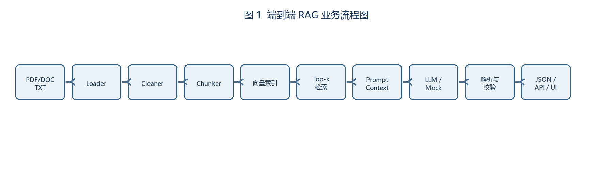

# 智能法律助手需求规格说明书（SRS）

| 项目 | 内容 |
|---|---|
| 项目名称 | Intelligent Legal Assistant（基于 RAG 的智能法律问答与文档管理系统） |
| 版本/日期 | v1.0 / 2026-07-16 |
| 作者 | Intelligent Legal Assistant Team |
| 运行约束 | CPU、可离线运行；LLM/Embedding 可替换为 Mock；禁止依赖公网 |
| 保密级别 | 内部考试材料 |

## 版本修订记录

| 版本 | 日期 | 说明 |
|---|---|---|
| v1.0 | 2026-07-16 | 初版，覆盖文档处理、RAG 问答、权限与测试验收 |

## 1 引言、范围与术语

目标是将 PDF/DOC/DOCX/TXT 法律资料处理为可检索知识库，并通过带来源引用的 RAG 问答辅助法律检索。范围包括用户认证、会话、文档上传/处理、语义检索、问答、来源展示和管理接口；不提供自动法律裁判或未经审核的法律意见。

系统应在单机 CPU、离线条件下运行，外部模型不可用时使用 MockLLM/本地 Embedding。评测维度为可运行性、检索相关性、回答完整性、引用准确性、权限安全、鲁棒性；验收证据放在 `deliver_doc/evidence/`，代码证据见 `backend/app/`、`frontend/src/`。

术语：RAG（检索增强生成）、Chunk（文本块）、Embedding（向量表示）、Top-k（前 k 条检索结果）、RBAC（基于角色的访问控制）。引用格式统一为 `[{company}:{year}:p{page}]`，项目文档引用采用 `[ILA:2026:path]`。

## 2 总体描述

### 2.1 用户与场景

普通用户上传法规并提问；管理员维护用户、角色、权限和文档分类；评测人员执行批量问答与回归测试。典型流程：登录 → 上传文档 → 解析/清洗/切块 → 生成向量并写入 Milvus → 语义检索 → Prompt 组装 → LLM/MockLLM → 引用解析 → 返回答案和来源。

### 2.2 端到端流程

| 能力 | SRS 落点 |
|---|---|
| 文档解析 | FR-01，`document_processor/*` |
| 清洗切块 | FR-02/03，`preprocessors.py`、`chunk_strategies.py` |
| 向量检索 | FR-04/05，`langchain_processor/retrieval_service.py`、`vector_store/` |
| 问答与引用 | FR-06/07/09，`services/chat/rag_service.py` |
| 指标与验收 | FR-08、NFR-04，`deliver_doc/output/*测试*` |
| API/UI | FR-10，`api/`、`frontend/src/` |

## 3 功能需求（FR）

| ID | 需求描述 | 输入/输出 | 验收口径 |
|---|---|---|---|
| FR-01 | 解析 PDF/DOC/DOCX/TXT，保留 `page/source/section` | 文件 → Document[] | 3 个样例文件成功率 100%；缺失文件返回 4xx |
| FR-02 | 去页眉页脚、断词修复、空白和标点归一、公司名规范化 | Document → CleanDocument | 清洗前后差异可审计，非法编码不崩溃 |
| FR-03 | 固定切块 `chunk_size=500, overlap=50` | 文本 → Chunk[] | 每块含 `section/chunk_id`；边界块不丢字 |
| FR-04 | 本地向量索引，支持 Milvus；离线环境可切换内存 Mock | Chunk[] → index | 首次创建、重启加载均成功；索引损坏可重建 |
| FR-05 | 语义检索 Top-k=5，支持可选 BM25 混检及去重 | query → Evidence[] | 返回不超过 5 条且引用去重；命中率达到测试阈值 |
| FR-06 | 仅依据 CONTEXT 生成答案，强制引用 `[{company}:{year}:p{page}]` | query+context → prompt | 无上下文不得编造；引用非空且格式 100% 合规 |
| FR-07 | LLM/MockLLM 调用、超时和 JSON 解析降级 | prompt → payload | 解析失败返回可用 JSON、保留 notes 和引用兜底 |
| FR-08 | 从 CSV 对齐 revenue、net_profit、solvency_ratio、total_assets、eps | answer+CSV → 校验结果 | 绝对/相对误差 ≤5% 视为一致；否则降 confidence 并写 notes |
| FR-09 | 统一输出 `answer,citations,used_metrics,confidence,notes` | payload → JSON | 字段齐全、类型正确；引用来源真实存在 |
| FR-10 | 提供认证、会话、文档、搜索、问答 REST API | HTTP JSON | 关键接口 2xx；错误返回统一结构 |

## 4 非功能需求（NFR）

| ID | 要求 | 指标/验收 |
|---|---|---|
| NFR-01 | CPU/离线可运行 | 无公网时 E2E 成功率 100%（样例集） |
| NFR-02 | 鲁棒性 | 空目录、缺列、坏索引、空检索、超长上下文均返回友好错误 |
| NFR-03 | 日志 | INFO/ERROR/EXCEPTION 含加载量、chunk 数、检索数、耗时、降级原因 |
| NFR-04 | 性能 | 10 页样例端到端 ≤ 3 分钟；单问答 P95 ≤ 10 秒（CPU基线） |
| NFR-05 | 可维护性 | `.env` 可覆盖默认配置；目录、依赖和迁移脚本可复现 |
| NFR-06 | 安全 | JWT Bearer、RBAC、上传类型/大小校验、用户数据隔离 |

## 5 数据、接口与错误

数据目录：`knowledge_document/` 原文，`data/processed/` 清洗结果，`data/vector_store/` 索引，`data/eval/dev_set.jsonl` 评测集，`logs/` 运行日志。CSV 字段：`company(str),year(int),revenue(float,亿元),net_profit(float,亿元),solvency_ratio(float,% ),total_assets(float,亿元),eps(float,元/股)`。

核心 API：`POST /api/auth/login`、`POST /api/chat/send`、`POST /api/documents/upload`、`POST /api/documents/search`、`GET /health`。错误 JSON：`{"error":true,"code":400,"message":"...","detail":"..."}`；状态码 400/401/403/404/422/500 分别表示参数、认证、权限、资源、校验和服务错误。

## 6 验收、评测与追踪矩阵

通过标准：E2E 100%；引用格式合规率 100%；引用准确率 ≥90%；指标一致率 ≥90%；dev_set Acc ≥85%、平均 confidence ≥0.75；异常用例通过率 ≥95%。

| FR/NFR | 设计模块 | 测试用例 | 证据/缺陷 |
|---|---|---|---|
| FR-01 | Loader | TC-PDF-001, TC-DOC-002 | `evidence/loader.log` |
| FR-02 | Cleaner | TC-CLN-003 | `evidence/clean_diff.txt` |
| FR-03 | Chunker | TC-CHK-004 | `evidence/chunks.json` |
| FR-04 | Indexer | TC-IDX-005/006 | `evidence/index.log` |
| FR-05 | Retriever | TC-RET-007/008 | `evidence/retrieval.json` |
| FR-06/07 | Prompt/LLM/Parser | TC-PRM-009, TC-LLM-010 | `evidence/prompt.json` |
| FR-08 | Validator | TC-VAL-012 | `evidence/metrics.json` |
| FR-09/10 | API/Synthesizer | TC-OUT-011, TC-CLI-013 | `evidence/api.json` |
| NFR-01~06 | 部署/日志/安全 | TC-NFR-014~018 | `evidence/e2e.log` |

## 7 风险与附录

风险：扫描 PDF 文本层缺失（P1，转 OCR/人工上传）；Milvus 不可用（P0，切内存索引）；模型输出非 JSON（P0，Mock/规则解析降级）；长上下文截断（P1，按块优先级裁剪）。每个 P0/P1 缺陷需至少一次回归并记录在测试报告。

附录证据路径约定：命令输出 `evidence/cli/*.json`，日志 `evidence/logs/*.log`，截图 `evidence/screenshots/*.png`，评测汇总 `evidence/eval_summary.csv`。

## 8 详细业务流程与状态定义

### 8.1 文档生命周期

| 状态 | 进入条件 | 允许操作 | 退出条件 |
|---|---|---|---|
| `uploaded` | 文件上传成功且通过扩展名校验 | 查看、删除、开始处理 | 处理任务启动 |
| `processing` | Loader 已接收任务 | 查询进度、取消任务 | 全部 chunk 入库或失败 |
| `completed` | 索引和元数据写入成功 | 检索、问答、重新索引 | 删除或重新处理 |
| `failed` | 解析、存储或索引失败 | 查看错误、重试、删除 | 重试成功或删除 |

### 8.2 问答业务规则

1. 用户必须通过 JWT 认证，且只能检索本人或被授权的文档。
2. 检索结果按向量相似度降序排列；开启 BM25 时使用 `0.7*semantic + 0.3*bm25`，同一 `document_id/chunk_id` 去重。
3. Prompt 中每个证据块必须包含来源元数据，模型不得使用 CONTEXT 之外的信息；无证据时返回“未找到可靠来源”。
4. Parser 先尝试严格 JSON，再尝试 Markdown 代码块 JSON，最后生成 fallback payload；fallback 必须保留至少一条真实引用或明确标记无引用。
5. 指标校验以公司+年份为主键，数值采用绝对误差和相对误差双重判定，任一指标超过 5% 即记录 mismatch。

## 9 详细数据字典

| 实体/字段 | 类型 | 必填 | 约束/示例 |
|---|---|---:|---|
| User.id | UUID | 是 | 主键 |
| User.username | string | 是 | 3~64 字符，唯一 |
| User.role | enum | 是 | `admin/user/auditor` |
| Document.id | UUID | 是 | 主键 |
| Document.file_type | enum | 是 | `pdf/doc/docx/txt` |
| Document.status | enum | 是 | `uploaded/processing/completed/failed` |
| Chunk.chunk_id | string | 是 | `docId-page-index` |
| Chunk.page | integer | 是 | ≥1 |
| Chunk.content | text | 是 | UTF-8，最大 500 字符（可含 overlap） |
| Message.role | enum | 是 | `user/assistant/system` |
| Message.content | text | 是 | 非空，最大 8,000 字符 |
| Answer.citations | string[] | 是 | 正则 `^\\[[^:]+:\\d{4}:p\\d+\\]$` |
| Answer.confidence | number | 是 | 0~1，保留两位小数 |

## 10 接口字段级规范

### 10.1 `POST /api/chat/send`

请求：`{"content": "...", "conversation_id": "uuid|null", "use_rag": true, "top_k": 5}`。响应：`message_id`、`content`、`intent`、`question_analysis`、`retrieved_docs[]`、`tokens_used`、`sources[]`；失败时返回统一错误对象。幂等键使用 `X-Request-ID`，重复请求不重复写入消息。

### 10.2 `POST /api/documents/upload`

使用 `multipart/form-data`，字段 `file`、`title`、`category_id`。限制单文件 50 MB、文件名 UTF-8、扩展名白名单；返回 `id/title/filename/file_size/status/created_at`。病毒扫描或解析失败时状态为 `failed`，不产生可检索 chunk。

### 10.3 `POST /api/documents/search`

请求 `{"query":"劳动合同解除","top_k":5,"use_bm25":false,"category_id":"uuid|null"}`；响应每条包含 `document_id,document_title,chunk_content,similarity,metadata{page,section,source}`。`top_k` 允许 1~20，超出返回 422。

## 11 可观测性与审计要求

每次请求生成 trace_id；日志字段包括 `timestamp,trace_id,user_id,operation,duration_ms,status,error_code`。管理员操作（用户、角色、文档删除、权限变更）写入审计表，保存 180 天。敏感字段（密码、token、API key）禁止写日志；异常堆栈仅在开发模式输出。
