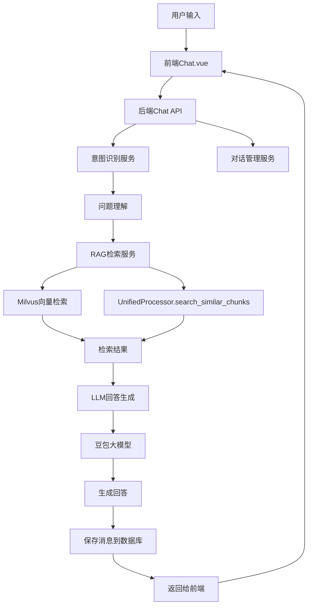
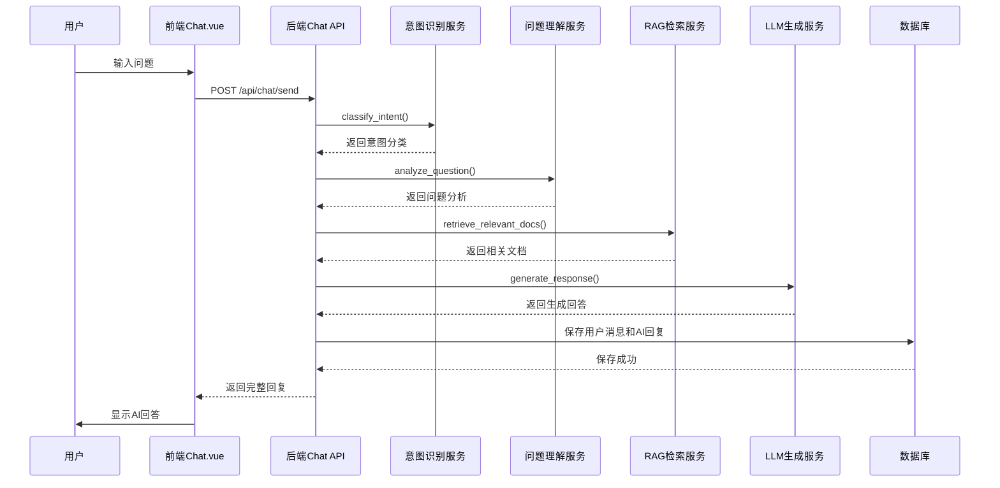

# 智能法律聊天功能开发计划

## 产品概述

开发智能法律咨询聊天功能，实现基于RAG的智能问答系统。用户可提交法律相关问题，系统通过意图识别、问题理解、知识库检索和LLM生成，提供准确的法律建议和参考案例。

## 核心功能

- **意图识别与分类**: 自动判断用户输入是否为法律类问题，并识别具体法律领域
- **问题理解与拆解**: 分析用户问题的核心诉求，提取关键信息
- **RAG检索**: 基于向量相似度从知识库检索相关法律法规、案例和文档片段
- **智能回答生成**: 使用豆包大模型结合检索结果生成专业、准确的法律建议
- **对话管理**: 支持多轮对话上下文保持、历史记录查询、会话创建与归档
- **前端交互**: 实时聊天界面，显示用户消息和AI回复，支持消息流式输出

## 技术栈

- **后端**: FastAPI + Python 3.10+
- **前端**: Vue3 + TypeScript + Element Plus + Pinia
- **数据库**: PostgreSQL (AsyncSQL)
- **向量库**: Milvus
- **对象存储**: MinIO
- **LLM**: 豆包大模型
- **Embedding**: 豆包多模态Embedding模型

## 系统架构

### 整体架构



### 模块划分

#### 1. 意图识别模块 (`backend/app/services/intent_service.py`)

- **职责**: 判断用户问题是否为法律相关，识别法律领域
- **技术**: 豆包LLM进行意图分类
- **接口**: `classify_intent(query: str) -> IntentClassification`

#### 2. 问题理解模块 (`backend/app/services/question_analyzer.py`)

- **职责**: 分析用户问题，提取关键信息、法律要素
- **技术**: NLP解析 + LLM提取
- **接口**: `analyze_question(query: str, context: List[Message]) -> QuestionAnalysis`

#### 3. RAG检索服务 (`backend/app/services/rag_service.py`)

- **职责**: 协调向量检索，整合多种检索策略
- **技术**: Milvus + UnifiedProcessor
- **接口**: `retrieve_relevant_docs(query: str, top_k: int) -> List[DocumentChunk]`

#### 4. 对话生成服务 (`backend/app/services/chat_service.py`)

- **职责**: 协调整个对话流程，生成最终回复
- **技术**: RAG Pipeline + 豆包LLM
- **接口**: `generate_response(query: str, conversation_id: str) -> ChatResponse`

#### 5. 前端聊天组件 (`frontend/src/views/Chat.vue`)

- **职责**: 提供聊天界面，处理用户输入和消息展示
- **技术**: Vue3 Composition API + Element Plus
- **功能**: 消息发送、流式显示、历史加载

## 数据流

### 对话流程



## 实现细节

### 核心目录结构

#### 后端新增/修改文件

```
backend/
├── app/
│   ├── api/
│   │   └── chat.py                      # 新增：聊天API路由
│   ├── services/
│   │   ├── intent_service.py            # 新增：意图识别服务
│   │   ├── question_analyzer.py        # 新增：问题理解服务
│   │   ├── rag_service.py              # 新增：RAG检索服务
│   │   ├── chat_service.py             # 新增：对话生成核心服务
│   │   └── langchain_processor/
│   │       └── retrieval_service.py     # 修改：实现检索逻辑
│   └── models/
│       └── conversation.py              # 修改：已存在，无需修改
```

#### 前端新增/修改文件

```
frontend/
├── src/
│   ├── config/
│   │   └── api.ts                       # 修改：添加聊天相关端点
│   ├── services/
│   │   └── chat.ts                      # 新增：聊天API服务
│   ├── stores/
│   │   └── chat.ts                      # 新增：聊天状态管理
│   ├── types/
│   │   └── chat.ts                      # 新增：聊天相关类型定义
│   └── views/
│       └── Chat.vue                     # 修改：对接真实API
```

### 关键代码结构

#### 意图分类数据结构

```python
class IntentClassification(BaseModel):
    """意图分类结果"""
    is_legal_related: bool           # 是否为法律相关问题
    legal_category: Optional[str]    # 法律领域（民事、刑事、商事等）
    confidence: float                # 置信度
    suggested_topics: List[str]      # 建议的相关话题
```

#### 问题分析数据结构

```python
class QuestionAnalysis(BaseModel):
    """问题分析结果"""
    core_issue: str                  # 核心问题
    legal_elements: List[str]        # 法律要素
    key_entities: List[str]          # 关键实体
    query_for_retrieval: str         # 用于检索的优化查询
    missing_info: List[str]          # 缺失信息
```

#### 聊天响应数据结构

```python
class ChatResponse(BaseModel):
    """聊天响应"""
    message_id: str
    content: str
    intent: IntentClassification
    analysis: QuestionAnalysis
    retrieved_docs: List[RetrievedDoc]
    tokens_used: int
    thinking_process: Optional[str]   # 思考过程（可选）
```

### 技术实现计划

#### 1. 意图识别服务

- **问题**: 判断用户输入是否为法律相关问题
- **解决方案**: 使用豆包LLM进行分类，设置明确的提示词
- **关键步骤**:

1. 设计法律领域分类体系
2. 编写意图识别提示词
3. 实现LLM调用和结果解析
4. 添加置信度评估机制

#### 2. 问题理解服务

- **问题**: 准确理解用户问题的法律含义
- **解决方案**: NLP提取 + LLM深度分析
- **关键步骤**:

1. 提取关键实体和术语
2. 识别法律关系和要素
3. 生成优化的检索查询
4. 识别缺失信息

#### 3. RAG检索服务

- **问题**: 高效检索相关法律文档
- **解决方案**: 基于UnifiedProcessor.search_similar_chunks
- **关键步骤**:

1. 调用现有search_similar_chunks方法
2. 实现结果过滤和重排序
3. 支持多策略检索（向量、BM25、混合）
4. 添加检索结果质量评估

#### 4. 对话生成服务

- **问题**: 生成专业、准确的法律建议
- **解决方案**: RAG Pipeline + 上下文管理
- **关键步骤**:

1. 构建检索上下文提示词
2. 调用豆包LLM生成回答
3. 添加来源引用和免责声明
4. 管理对话历史和上下文

#### 5. 前端聊天界面

- **问题**: 提供流畅的聊天体验
- **解决方案**: Vue3 + Element Plus + 流式输出
- **关键步骤**:

1. 对接真实Chat API
2. 实现消息流式显示
3. 加载历史对话和消息
4. 添加思考过程和来源引用展示

### 集成点

#### 外部依赖

- **豆包API**: 意图识别、问题理解、回答生成
- **Milvus**: 向量相似度检索
- **UnifiedProcessor**: 文档分块检索
- **PostgreSQL**: 对话和消息存储

#### 内部模块依赖

- ChatService 依赖 IntentService, QuestionAnalyzer, RagService
- RagService 依赖 UnifiedProcessor
- Chat API 依赖 ChatService
- 前端 依赖 Chat API

## 技术考虑

### 性能优化

- **检索优化**: 实现结果缓存机制，减少重复检索
- **并发处理**: 使用异步IO提升性能
- **批量处理**: 支持批量检索和生成
- **流式输出**: 前端实现流式响应，提升用户体验

### 安全措施

- **输入验证**: 对用户输入进行严格验证和过滤
- **敏感信息**: 识别并处理用户提供的敏感信息
- **内容过滤**: 检测和过滤不当内容
- **权限控制**: 基于用户身份限制对话访问

### 可扩展性

- **模块化设计**: 各服务独立，易于扩展和替换
- **配置驱动**: 支持通过配置调整行为
- **插件机制**: 支持添加新的检索策略和LLM模型
- **监控日志**: 完善的日志记录，便于问题排查和优化

## 设计风格

采用现代专业的法律科技风格，结合企业级UI组件库Element Plus，打造专业、可信、易用的法律咨询聊天界面。

## 设计架构

基于Vue3 Composition API和Element Plus组件库，构建响应式、组件化的聊天界面。使用Pinia进行状态管理，支持实时消息更新和历史记录管理。

## 页面规划

### 聊天主界面

1. **侧边栏区块**: 显示对话历史列表，支持新建、切换和删除对话
2. **顶部导航区块**: 当前对话标题、保存和删除操作按钮
3. **消息展示区块**: 展示用户和AI的消息，包含消息发送者、时间戳、思考过程、来源引用
4. **输入区域区块**: 文本输入框、发送按钮、文件上传和语音输入功能入口

## 设计内容

### 整体风格

- **主题色**: 深蓝色为主色调，象征专业和信任
- **布局**: 经典聊天布局，左侧侧边栏 + 右侧主对话区
- **氛围**: 专业、高效、温暖的法律咨询服务体验
- **动画**: 平滑的消息过渡动画和加载状态

### 页面设计

#### 聊天主界面

- **侧边栏**: 宽280px，浅灰背景，对话列表项悬停高亮，当前选中项深蓝背景白字
- **消息区域**: 白色背景，用户消息右对齐（深蓝背景），AI消息左对齐（浅灰背景）
- **消息气泡**: 圆角8px，阴影效果，内边距适中
- **输入框**: 圆角矩形，高度自适应，带发送按钮，支持多行输入
- **加载状态**: AI回复时显示打字动画或加载进度条

#### 消息展示细节

- **用户消息**: 蓝色背景，白色文字，右上角头像和时间
- **AI消息**: 浅灰背景，深色文字，左上角AI助手图标和时间
- **来源引用**: 在AI消息下方以折叠卡片形式展示相关文档片段
- **思考过程**: 可选展示AI的分析过程，以可折叠面板形式呈现

### 响应式设计

- 桌面端(>768px): 完整侧边栏+主对话区布局
- 平板端(768-1024px): 侧边栏可收起/展开
- 移动端(<768px): 单栏布局，通过抽屉式导航显示对话列表
