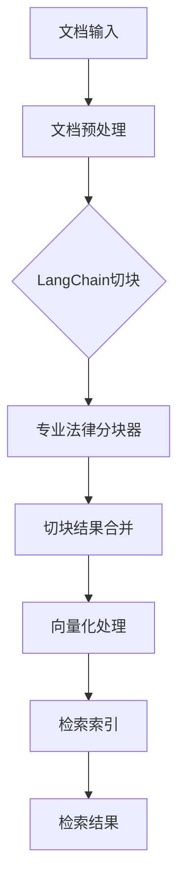

## 产品概述

智能法律助手的LangChain集成计划，实现文档切块和检索功能的统一架构

## 核心功能

- 集成LangChain框架进行文档切块处理
- 保留专业法律文档分块器的优势功能
- 实现统一的文档处理流程
- 支持文档检索功能
- 提供灵活的文档切块策略配置

## 技术栈

- 后端框架：Python + FastAPI
- 文档处理：LangChain + 现有LegalDocumentChunker
- 向量数据库：Chroma/FAISS（可选）
- 异步处理：asyncio

## 技术架构

### 系统架构

采用分层架构模式，将LangChain集成到现有的文档处理流程中，同时保留专业法律分块器的功能优势。



### 模块划分

- **LangChain集成模块**：负责集成LangChain的文档切块功能
- **法律分块器适配模块**：桥接LangChain与现有LegalDocumentChunker
- **统一处理流程模块**：协调两种切块策略的协同工作
- **检索服务模块**：提供基于切块结果的检索功能

### 数据流

文档输入 → 预处理 → LangChain切块 → 法律分块器处理 → 结果合并 → 向量化 → 索引构建 → 检索服务

## 实现细节

### 核心目录结构

```
Intelligent_Legal_Assistant/
├── src/
│   ├── langchain_integration/
│   │   ├── __init__.py
│   │   ├── chunker_adapter.py      # 分块器适配器
│   │   ├── unified_processor.py    # 统一处理器
│   │   └── retrieval_service.py    # 检索服务
│   ├── document_processing/
│   │   └── legal_document_chunker.py  # 现有法律分块器
│   └── utils/
│       └── config.py               # 配置管理
```

### 关键代码结构

**分块器适配器接口**：定义统一的文档切块接口，支持LangChain和LegalDocumentChunker的协同工作。

```python
class ChunkerAdapter:
    def __init__(self, langchain_chunker, legal_chunker):
        self.langchain_chunker = langchain_chunker
        self.legal_chunker = legal_chunker
    
    async def chunk_document(self, document, strategy="hybrid"):
        """统一文档切块方法"""
        pass
```

**统一处理器类**：协调两种切块策略，提供灵活的配置选项。

```python
class UnifiedDocumentProcessor:
    def __init__(self, config):
        self.config = config
        self.chunker_adapter = ChunkerAdapter(...)
    
    async def process_document(self, document):
        """统一文档处理流程"""
        pass
```

## 代理扩展

### SubAgent

- **code-explorer**
- 目的：探索现有代码库结构，了解LegalDocumentChunker的实现细节
- 预期结果：获取现有法律分块器的接口定义和功能特性